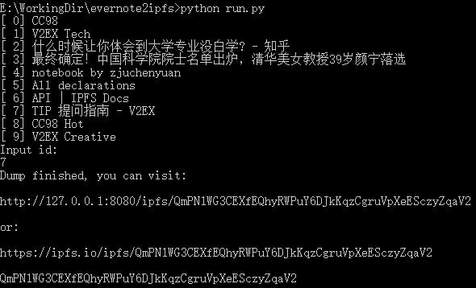

# Evernote To IPFS 印象笔记导出到IPFS

Author: [zjuchenyuan](https://py3.io)

## 使用情景 - 让互联网拥有记忆

遇到喜欢的/可能被删的网页，使用印象笔记的剪藏功能存到印象笔记后

导出到IPFS，只需要发送一个cid，便于网络上其他人pin，最终使得永久保存网页

替代方案：使用web.archive.org，但其遵循robots.txt，且不能保存需要登录才能看 和 js动态渲染的内容

## 前置要求
1. 印象笔记API token：但现在印象笔记和Evernote都关闭了新用户申请，你可能需要发多次工单以请求开放此功能
2. IPFS： 本程序会调用子进程ipfs add，所以你需要正在运行ipfs daemon，并**把ipfs加入到PATH**
3. 本代码需要 python3 并 安装evernote-sdk-python3：注意pip安装获取的代码版本不支持印象笔记，需要使用git clone得到最新的代码
 
以下安装方法供参考：

```
pip3 install evernote3 -i https://pypi.doubanio.com/simple/ --trusted-host pypi.doubanio.com
pip3 uninstall -y evernote3
git clone --depth 1 https://github.com/evernote/evernote-sdk-python3
cd evernote-sdk-python3
python3 setup.py install
```

## 直接运行

```
git clone --depth 1 https://github.com/zjuchenyuan/evernote2ipfs
cd evernote2ipfs
# add your auth_token to config.py, example: 
# auth_token = "S=s28:U..."
python3 run.py
```

请在config.py中给出你的auth_token，此token在[这里](https://app.yinxiang.com/api/DeveloperToken.action)获取

然后直接运行本代码 `python3 run.py`，将列出最新的10条笔记名称

输入你想导出的笔记id

等待笔记下载（缓存将写入__pycache__文件夹） 和 笔记处理(en-media转为img标签)

最后将输出ipfs的id

## 例子



[https://ipfs.io/ipfs/QmPN1WG3CEXfEQhyRWPuY6DJkKqzCgruVpXeESczyZqaV2](https://ipfs.io/ipfs/QmPN1WG3CEXfEQhyRWPuY6DJkKqzCgruVpXeESczyZqaV2)

## 一点讨论

### 安全性讨论

注意保密你的auth_token，其地位与你的印象笔记密码相同，如果泄露需要及时Revoke

ipfs不会主动推送你的文件到其他节点，本代码执行后全球网络应该只会有一份(你的电脑上)

如果你访问了`ipfs.io/ipfs/...`或其他公共gateway的链接，gateway将从你的电脑上下载对应文件，并缓存一段时间

建议先访问`127.0.0.1:8080/ipfs/...`的链接，确认没有隐私泄露可以分享后再访问公共gateway

### ipfs数据持久性讨论

ipfs网络是会丢数据的！ 整个网络中没有任何节点pin、且公共gateway缓存过期后，数据就丢失了

你可能需要ipfs pinning service，如[eternum.io](https://www.eternum.io/)

或者购买vps，自己手动pin你需要保留的资源

## 欢迎贡献

感谢你的阅读和关注~ 不如给个Star吧~
